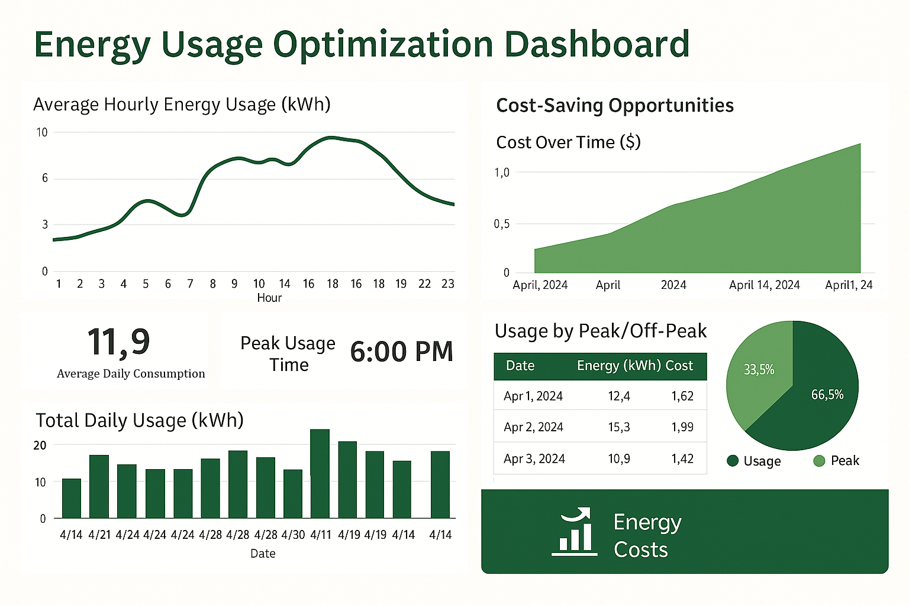

# Energy Usage Optimization Dashboard

##  Project Overview
This project aims to analyze and visualize residential energy consumption data to help identify cost-saving opportunities and support energy-efficient decision-making. It simulates a real-world use case where a smart energy company wants to provide its customers with actionable insights based on their power usage patterns.


##  Problem Statement
Households often face high electricity bills due to peak-time energy usage. The goal is to analyze smart meter data and develop a dashboard that:
- Monitors hourly/daily energy consumption
- Identifies peak usage periods
- Suggests behavioral changes to reduce costs

##  Directory Structure
```
energy-usage-optimization-dashboard/
├── README.md
├── data/
│   └── sample_energy_data.csv
├── notebooks/
│   └── energy_analysis.ipynb
├── dashboard/
│   └── energy_dashboard.pbix
│   └── dashboard_screenshots.png
└── report.pdf (optional)
```

##  Tools & Technologies
- Python (Pandas, Matplotlib, Seaborn)
- Power BI
- Excel
- SQL (for aggregation queries, optional)

##  KPIs Tracked
- Average Daily Energy Consumption (kWh)
- Peak Hour Usage
- Cost Estimation by Time-of-Use
- % Usage During Off-Peak Hours

##  Key Insights
- Identified peak usage typically between 6–9 PM
- Shifting appliance usage to off-peak hours could reduce total monthly cost by up to **20%**
- Simple behavioral changes (e.g., delay dishwasher usage) can yield measurable savings

##  Audience
This project is designed for:
- Energy company operations analysts
- Non-technical business stakeholders
- Sustainability-focused homeowners

##  Next Steps
- Integrate weather data for deeper correlation analysis
- Build a real-time streaming dashboard using Streamlit or Power BI Embedded
- Add forecasting for load prediction and seasonal adjustments
